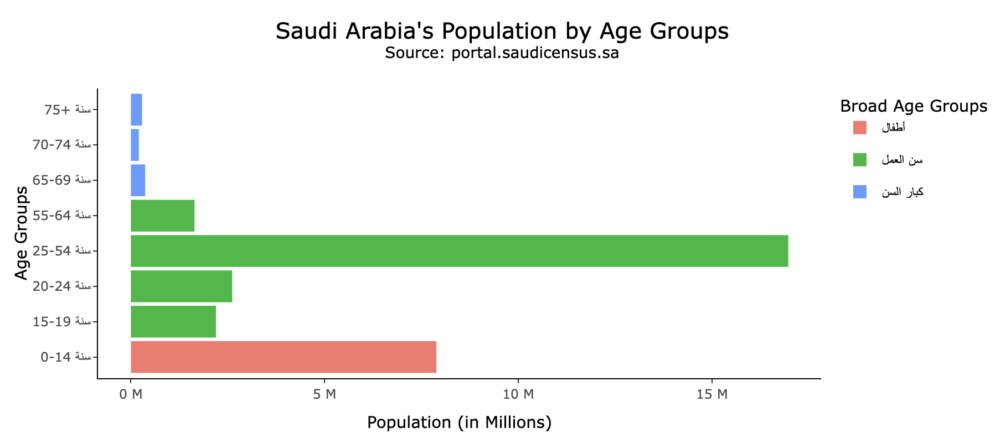

# Shiny App for analyzing Saudi Arabia's Population

We created a Shiny Application in a form of a Dashboard that uses visualizations to showcase the evolution of Saudi Arabia's Population between 2010 and 2022.

[![License][license-shield]][https://github.com/0abdullah0sami0/Main-Saudi-Population-App/blob/master/LICENSE.md]
[![LinkedIn][linkedin-shield]][https://www.linkedin.com/in/abdullahalshalaan/]

<!-- PROJECT LOGO -->
 

  

  <h3 align="center">Shiny App for analyzing Saudi Arabia's Population</h3>

  

We created a Shiny Application in a form of a Dashboard that uses visualizations to showcase the evolution of Saudi Arabia's Population between 2010 and 2022.
     
    <a href="https://abdullah-hr.shinyapps.io/Main_Saudi_Population_App/"><strong>Explore the application »</strong></a>
     
     
  

<!-- TABLE OF CONTENTS -->

  
Table of Contents

  <ol>
    <li>
      <a href="#about-the-project">About The Project</a>
      <ul>
        <li><a href="#built-with">Built With</a></li>
      </ul>
    </li>
    <li>
      <a href="#getting-started">Getting Started</a>
      <ul>
        <li><a href="#prerequisites">Prerequisites</a></li>
        <li><a href="#installation">Installation</a></li>
      </ul>
    </li>
    <li><a href="#usage">Usage</a></li>
    <li><a href="#roadmap">Roadmap</a></li>
    <li><a href="#contributing">Contributing</a></li>
    <li><a href="#license">License</a></li>
    <li><a href="#contact">Contact</a></li>
    <li><a href="#acknowledgments">Acknowledgments</a></li>
  </ol>

<!-- ABOUT THE PROJECT -->
## About The Project

[![Product Name Screen Shot][product-screenshot]](English.png)
[![Product Name Screen Shot][product-screenshot]](Arabic.png)

We build a Shiny dashboard using Saudi census data, which contains a complete and accurate count of the Saudi population. Our online dashboard enables users to view the growth of Saudi Arabia's population between 2020 and 2022. Our study focused on examining various aspects of the Saudi population structure, including gender, nationalities, age groups, and life expectancy.

The Dashboard is created in both English and Arabic to make it accessible to all.

The Dashboard provides visualizations for the following points:
* Population by Age Groups
* Population by Nationality
* Population by Gender
* Population by Gender and Nationality
* Population by Region
* Population by Age Groups and Gender
* Population by Age Groups and nationality
* Life Expectancy by Years

(<a href="#readme-top">back to top</a>)

### Built With

This project was built in Rsudio using R language and Shiny package. Here is the complete list of libraries included in the project:

* [![RStudio][RStudio.com]][https://posit.co/download/rstudio-desktop/]
* [![Shiny][Shiny.com]][https://www.rstudio.com/products/shiny/]
* [![readxl][readxl.com]][https://readxl.tidyverse.org/]
* [![tidyverse][tidyverse.com]][https://www.tidyverse.org/]
* [![plotly][plotly.com]][https://plotly.com/r/]
* [![RColorBrewer][RColorBrewer.com]][https://rdrr.io/cran/RColorBrewer/]
* [![shinydashboard][shinydashboard.com]][https://www.rdocumentation.org/packages/shinydashboard/versions/0.7.2]
* [![shinythemes][shinythemes.com]][https://www.rdocumentation.org/packages/shinythemes/versions/1.2.0]
* [![shinyWidgets][shinyWidgets.com]][https://rdrr.io/cran/shinyWidgets/]
* [![scales][scales.com]][https://scales.r-lib.org/]

(<a href="#readme-top">back to top</a>)

<!-- LICENSE -->
## License

Distributed under the Creative Commons Attribution 4.0 International License. See `LICENSE.md` for more information.

(<a href="#readme-top">back to top</a>)

<!-- ACKNOWLEDGMENTS -->
## Acknowledgments

The source of all data used to created the Dashboard is Saudi census.

* [Saudi census](https://portal.saudicensus.sa/portal)

(<a href="#readme-top">back to top</a>)

https://shields.io/

<!-- MARKDOWN LINKS & IMAGES -->
<!-- https://www.markdownguide.org/basic-syntax/#reference-style-links -->
[contributors-shield]: https://img.shields.io/github/contributors/othneildrew/Best-README-Template.svg?style=for-the-badge
[contributors-url]: https://github.com/othneildrew/Best-README-Template/graphs/contributors
[forks-shield]: https://img.shields.io/github/forks/othneildrew/Best-README-Template.svg?style=for-the-badge
[forks-url]: https://github.com/othneildrew/Best-README-Template/network/members
[stars-shield]: https://img.shields.io/github/stars/othneildrew/Best-README-Template.svg?style=for-the-badge
[stars-url]: https://github.com/othneildrew/Best-README-Template/stargazers
[issues-shield]: https://img.shields.io/github/issues/othneildrew/Best-README-Template.svg?style=for-the-badge
[issues-url]: https://github.com/othneildrew/Best-README-Template/issues
[license-shield]: https://img.shields.io/github/license/othneildrew/Best-README-Template.svg?style=for-the-badge
[license-url]: https://github.com/othneildrew/Best-README-Template/blob/master/LICENSE.txt
[linkedin-shield]: https://img.shields.io/badge/-LinkedIn-black.svg?style=for-the-badge&logo=linkedin&colorB=555
[linkedin-url]: https://linkedin.com/in/othneildrew
[product-screenshot]: images/screenshot.png
[Next.js]: https://img.shields.io/badge/next.js-000000?style=for-the-badge&logo=nextdotjs&logoColor=white
[Next-url]: https://nextjs.org/
[React.js]: https://img.shields.io/badge/React-20232A?style=for-the-badge&logo=react&logoColor=61DAFB
[React-url]: https://reactjs.org/
[Vue.js]: https://img.shields.io/badge/Vue.js-35495E?style=for-the-badge&logo=vuedotjs&logoColor=4FC08D
[Vue-url]: https://vuejs.org/
[Angular.io]: https://img.shields.io/badge/Angular-DD0031?style=for-the-badge&logo=angular&logoColor=white
[Angular-url]: https://angular.io/
[Svelte.dev]: https://img.shields.io/badge/Svelte-4A4A55?style=for-the-badge&logo=svelte&logoColor=FF3E00
[Svelte-url]: https://svelte.dev/
[Laravel.com]: https://img.shields.io/badge/Laravel-FF2D20?style=for-the-badge&logo=laravel&logoColor=white
[Laravel-url]: https://laravel.com
[Bootstrap.com]: https://img.shields.io/badge/Bootstrap-563D7C?style=for-the-badge&logo=bootstrap&logoColor=white
[Bootstrap-url]: https://getbootstrap.com
[JQuery.com]: https://img.shields.io/badge/jQuery-0769AD?style=for-the-badge&logo=jquery&logoColor=white
[JQuery-url]: https://jquery.com 